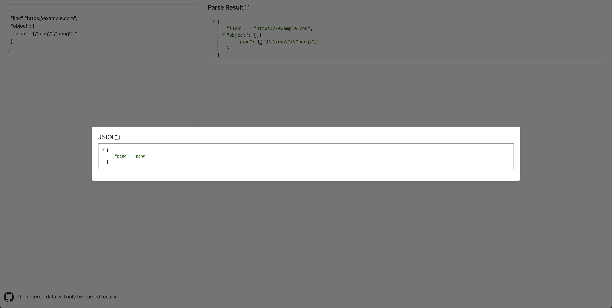

# yew-json-viewer

## Introduction

*yew-json-viewer* is a [yew](https://yew.rs) application that renders JSON data in a tree view.

Inspired by [json.cn](https://json.cn) and [jquery.json-viewer](https://github.com/abodelot/jquery.json-viewer).

Check out the [demo page](https://conanyu.github.io/yew-json-viewer)!

Features shown below:



## Usage

### Simple Usage

#### Online

visit the demo page: [https://conanyu.github.io/yew-json-viewer](https://conanyu.github.io/yew-json-viewer)

#### Local

- Clone the repository

```bash
git clone https://github.com/conanyu/yew-json-viewer
```

- Install [rust](https://www.rust-lang.org/)

- Install trunk from cargo

```bash
cargo install trunk --locked
```

- Run HTTP server

```bash
cd yew-json-viewer
trunk serve --release
```

### Secondary Development

#### Use In Rust WebAssembly Project

- Add dependency to `Cargo.toml`

```toml
[dependencies]
yew-json-viewer = { git = "https://github.com/conanyu/yew-json-viewer" }
gloo = "*" # optional
serde_json = "1" # optional
```

- Import and use `JsonViewer`

```rust
use yew::prelude::*;
use yew_json_viewer::JsonViewer;

#[function_component(App)]
pub fn app() -> Html {
    let data = serde_json::json!({"ping": "pong"});
    JsonViewer::new(data).render()
}

fn render() {
    let element = gloo::utils::document().get_element_by_id("app").unwrap();
    yew::Renderer::<App>::with_root(element).render();
}
```

#### Use In NPM Project

- Add dependency to `package.json`

```bash
npm install yew-json-viewer
```

- Import and use `json_view_render` in your JavaScript file like this:

```javascript
import init, { json_view_render, JsonViewRenderOption } from 'yew-json-viewer/main';
(async () => {
  await init();
  json_view_render(
    'app',
    JSON.stringify({'ping': 'pong'}),
    new JsonViewRenderOption(),
  )
})();
```

- Add `<div id="app"/>` to your HTML file

- Run your project

#### Use In Native HTML

- Download `main.js` and `main_bg.wasm` from [npmjs platform](https://www.npmjs.com/package/yew-json-viewer?activeTab=code)

- Import and use `json_view_render` in your HTML file like this:

```html
<html>
<body>
    <div id="app"></div>
    <script type="module">
        import init, { json_view_render, JsonViewRenderOption } from './main.js'
        (async () => {
            await init();
            json_view_render(
                'app',
                JSON.stringify({'ping': 'pong'}),
                new JsonViewRenderOption(),
            );
        })();
    </script>
</body>
</html>
```

- Run HTTP server

You can simply use python's built-in http server like this:

```bash
cd yew-json-viewer/docs
python -m http.server
```
